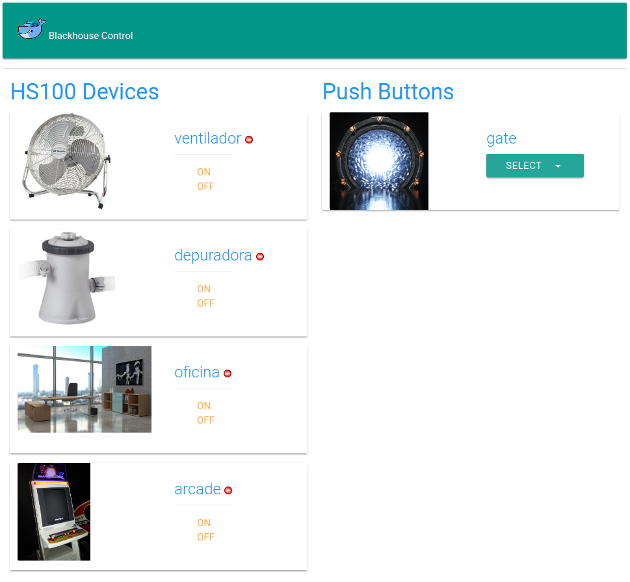

# BlackHouse Domo Control
## Author info
Roberto Salgado (DRoBeR). :email: Contact me through Github if needed.
* [Donations accepted](https://www.paypal.me/drober/10) (PayPal)

## Source code
Get code from [BlackHouse Github Source](https://github.com/droberin/blackhouse) pull requests are welcomed. :smile:
## Docker Images
Get images at [BlackHouse Images from Docker Hub](https://hub.docker.com/r/drober/blackhouse/) pull requests are welcomed. :smile:
## Controller
The main service is a container which will contact every device in the net.
One must run a container on every node that want to use as switch/push button device
## Switch Device Support
### GPIO pins (any Raspberry Pi)
Mainly tested in Raspberry Pi Zero W
### TP-Link HS100
Currently the only non-GPIO device supported. It's cheap (I got a few for 20€ each) and easy to handle.
Plus there are some nice python libraries to use it.
## Deployment
### Configuration files
#### Devices
There is an example of [device configuration](examples/devices.yaml.example) written in YAML (~~and JSON~~)
#### Panel Users
Use `users.json` file must be in container's `/app/etc/` folder to list valid panel users.

**WARNING:** if no `users.json` found in configuration folder, user `admin` will be created using the first password requested.
#### Telegram bot (optional)
##### Bot token
Telegram bots require a token to authenticate. Talk to [@BotFather](https://telegram.me/BotFather) to create your bot at get your token
###### Docker Secret
Telegram Bot Token can be retrieved from [docker secret](https://docs.docker.com/engine/reference/commandline/secret_create/) called ```telegram_token```
###### token file
File in data volume must contain ```/app/etc/.telegram_token``` to authenticate your Telegram bot. Check source code for examples.
##### Telegram users config
Telegram valid users must be set on ```/app/etc/users.json```. Check source code for examples.
### Controller / Frontend
The main service is a container which will contact every device in the net.
One must run a container on every node that want to use as switch/push button device

#### Considerations
HTTP will listen at ```5000``` port.
HTTPS will listen at ```5001``` port.
It will only listen in one of them. Depending on if it can find or not the SSL certificates in container's ```/app/etc/ssl``` folder

#### Running as a simple container
Example of running the ___controller___ in a _Raspberry Pi 3_
```
docker run -d -ti \
  -v /app/etc:/app/etc \
  --cap-add SYS_RAWIO --device /dev/mem \
  -e BH_SERVICE_TYPE=push \
  -p 5000:5000 -p 5001:5001 \
  drober/blackhouse:v1_pi3
```
#### Deploying controller in a Docker Stack (swarm)
Stack example. It uses a secret for the Telegram Bot, which is optional.
```
version: '3.1'
services:
  control:
    image: drober/blackhouse:v1_pi3
    ports:
      - 5000:5000
      - 5001:5001
    volumes:
      - /app/etc:/app/etc
    networks:
      - blackhousenet
    secrets:
      - telegram_token
    deploy:
      mode: replicated
      replicas: 1
      placement:
        constraints: [ node.role == manager ]
    labels:
      es.blackhouse.description: "Blackhouse Domotica"
      es.blackhouse.awesome: ""
networks:
  blackhousenet:
    driver: overlay
secrets:
  telegram_token:
    external: true
```

### Switch Device
#### Considerations
HTTP will listen at ```5002``` port.
HTTPS will listen at ```5003``` port.
It will only listen in one of them. Depending on if it can find or not the SSL certificates in container's ```/app/etc/ssl``` folder

#### Running as simple container
Example to run on a device name as ___gate___ which is a push device and is running on a _Raspberry Pi Zero W_
```
docker run -d -ti \
  --name blackhouse_switch_gate \
  -v /app/etc:/app/etc \
  --cap-add SYS_RAWIO --device /dev/mem \
  -e BH_SERVICE_TYPE=push \
  -p 5002:5002 -p 5003:5003 \
  drober/blackhouse:v1_piZeroW
```
